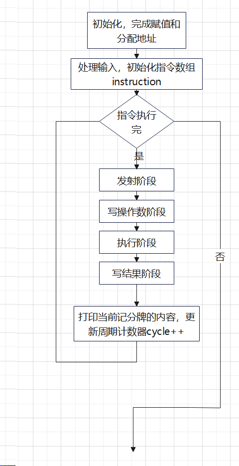

## 记分牌算法仿真器

#### 实验背景

计算机系统结构课程实验选题之算法仿真器，通过实现记分牌算法仿真器，模拟记分牌算法，实现指令的动态调度，加深对指令相关性的理解。


#### 记分牌指令动态调度算法原理

- 记分牌是一个集中控制部件，其功能是控制数据寄存器与处理部件之间的数据传送。在记分牌中保存有与各个处理部件相联系的寄存器中的数据装载情况。当一个处理部件所要求的数据都已就绪，记分牌允许处理部件开始执行。当执行完成后，处理部件通知记分牌释放相关资源。所以在记分牌中记录了数据寄存器和多个处理部件状态的变化情况，通过它来检测和消除或减少数据相关性，加快程序的执行速度。目的是再无资源竞争的前提下保持每一个时钟周期执行一条指令的速率。
- 思想方法：尽可能提早指令的执行。当一条指令暂停执行时，如果其他后继指令与暂停指令及已发射的指令无任何相关，则仍然可以发射，执行。


#### 框架

>   下面图展示了整个程序的执行流程。



#### 技术路线

程序总共包括两个部分，数据输入，数据处理和数据输出。输入包括流水线中指令序列的指令数、指令序列。输出包括每一周期的记分牌记录的三个状态表。

1. 数据结构：利用数组instruction，Busy，result来对应指令状态，功能部件和结果寄存器。

```
struct node  //指令结构 node 用于存储每条指令的详细信息
{
	string instrct;//指令字符串
	string op;//操作类型，如加载（LD）、加法（ADDD）等
	int busy;//指令当前占用的功能部件编号
	int fi;//目标寄存器
        int fj, fk;//源寄存器
        int qj, qk;//源操作数队列标识，用于跟踪操作数的来源
        int rj, rk;//标记源寄存器 fj 和 fk 的数据是否已经准备好
	int cycle;//指令完成所需的时钟周期数
	int time[4];//录指令在不同阶段的时间戳
};

vector<node> instruction;
vector<int> Busy;//记录当前占用功能部件的指令索引
vector<int> result;//记录写回结果的指令索引，用于跟踪寄存器的最新写入者
```


2.数据处理

根据读入的指令数和指令序列初始化instruction，将其解析为包括操作码、目的寄存器、操作数几部分。同时完成对每条指令的时钟周期的赋值。

```
void Instr_Init()
{
	cin >> n;
	instruction.resize(n + 1);

	for (i = 1; i <= n; i++)
	{
		getline(cin, s);//字符具有空格，用getline整行读入
		instruction[i].op = cal();
		instruction[i].fi = cal();
		instruction[i].fj = cal();
		instruction[i].fk = cal();
		if (s[0] == 'L')instruction[i].cycle = 1;
		else if (s[0] == 'A')instruction[i].cycle = 2;
		else if (s[0] == 'S')instruction[i].cycle = 2;
		else if (s[0] == 'D')instruction[i].cycle = 40;
		else if (s[0] == 'M')instruction[i].cycle = 10;
	}
}
```

初始化功能部件状态表中busy值为0，表示相应的功能部件当前是空闲的，即没有指令正在使用它。初始化结果寄存器状态表值为0，表示相应的寄存器当前没有写回操作，或者没有指令正在等待写回该寄存器的结果。

```
const int M = 30;//寄存器的个数
const int P = 5;//功能部件的个数
void init()//初始化
{
	Busy.resize(P + 1);
	result.resize(M + 1);
}
```


- 3.算法具体实现——程序的循环（核心部分）

**发射**：如果指令的一个功能单元空闲（功能部件状态的`busy`字段），且没有其它活动指令以同一寄存器为目标寄存器（目标寄存器状态是否为空），则记分牌向功能单元发射指令，并更新指令状态。该步骤能解决**结构冒险**和**WRW冒险。**

```
void issue_operation()
{
	int fu;//前指令要使用的功能单元
	if (x <= n) {
		//判断功能部件是否有空闲
		bool if_busy = false;
		if (instruction[x].op == a[5] && (!Busy[2] || !Busy[3])) if_busy = true;
		else {
			if (!Busy[Func[instruction[x].op]]) if_busy = true;
		}

		//判断是否有写后写（WAW）冲突
		if (if_busy && !result[instruction[x].fi]) {
			if (instruction[x].op == a[5]) {
				if (Busy[2] == 0) {
					instruction[x].busy = 2;
				}
				else if (Busy[3] == 0)
				{
					instruction[x].busy = 3;
				}
			}
			else if (!Busy[Func[instruction[x].op]]) {
				instruction[x].busy = Func[instruction[x].op];
			}
			//修改记分牌内容
			fu = instruction[x].busy;
			Busy[fu] = x;

			instruction[x].qj = instruction[result[instruction[x].fj]].busy;
			instruction[x].qk = instruction[result[instruction[x].fk]].busy;
			if (result[instruction[x].fj] == 0) instruction[x].rj = 1;
			else {
				instruction[x].rj = 0;
				wait[instruction[x].fj].push_back(x);
			}
			if (result[instruction[x].fk] == 0) instruction[x].rk = 1;
			else {
				instruction[x].rk = 0;
				wait[instruction[x].fk].push_back(x);
			}
			result[instruction[x].fi] = x;
			instruction[x].time[0] = cycle;
			tmp_process[1].push_back(x);
			x++;
		}
	}
}
```


**读取操作数**：如果不存在检查活动指令写入源寄存器（`Rj`和`Rk`字段为yes），则修改记分牌内容。该步骤能解决**RAW冒险**。

```
void read_operands()
{
	for (int x : process[2])
	{
		//判断源操作数是否准备就绪 
		if (instruction[x].rj && instruction[x].rk)
		{
			//修改记分牌内容
			instruction[x].time[1] = cycle;
			tmp_process[2].push_back(x);
		}
	}
}
```


**执行**：功能单元开始执行对应操作，更新功能单元状态。当结果就绪后，通知记分牌。将 `rj` 和 `rk` 重置为0，表示源操作数已被读取，不再需要等待（这个地方更新不能放在Read阶段，不然可能会出现读后写冲突！！！）

```
void execute()
{
	for (int x : process[3])
	{
		//修改记分牌内容
		instruction[x].rj = 0;
		instruction[x].rk = 0;
		instruction[x].cycle--;
		if (instruction[x].cycle == 0)
		{
			instruction[x].time[2] = cycle;
			tmp_process[3].push_back(x);
		}
	}
}
```


**写结果**：当其它活动指令不需要读取当前计算结果即将写入的寄存器，写回寄存器，并清空该条指令在记分牌记录的状态，同时修改以该指令目标寄存器作为源操作数的指令的`Rj`和`Rk`字段。该步骤能解决**WAR冒险**。

```
void write_result()
{
	int i, j, tmp;
	bool flag;
	for (int x : process[4]) {
		flag = false;
		//判断是否存在读后写（WAR）冲突
		for (int y : process[2])
		{
			if (y >= x) break;
			if ((instruction[y].fj != instruction[x].fi || instruction[y].rj == 0) && (instruction[y].fk != instruction[x].fi || instruction[y].rk == 0))
			{
			}
			else {
				flag = true;
				break;
			}
		}
		if (!flag) {
			instruction[x].time[3] = cycle;
			result[instruction[x].fi] = 0;
			Busy[instruction[x].busy] = 0;
			instruction[x].busy = 0;

			for (j = 0; j < wait[instruction[x].fi].size(); j++) {
				int y = wait[instruction[x].fi][j];
				if (instruction[y].fj == instruction[x].fi) instruction[y].rj = 1;
				if (instruction[y].fk == instruction[x].fi) instruction[y].rk = 1;
			}
			wait[instruction[x].fi].clear();

			tmp_process[4].push_back(x);
		}
	}
	for (i = 1; i <= 4; i++) {
		for (j = 0; j < tmp_process[i].size(); j++) {
			tmp = tmp_process[i][j];
			process[i].erase(tmp);
			process[i + 1].insert(tmp);

		}
		tmp_process[i].clear();
	}
}
```

然后每次大循环执行完毕之后，将结果Display一下，然后cycle++。

- 数据输出：

1.如果使用的是命令行编译器（如GCC或MinGW），打开命令提示符（cmd），导航到`.cpp`文件所在的目录，并使用编译器命令进行编译。如下：

```
g++ -o scoreboard scoreboard.cpp
```

运行程序：

```
scoreboard.exe
```

2.如果使用的是IDE（如Visual Studio、Code::Blocks或CLion），可以通过点击IDE中的构建或编译按钮来编译代码，点击运行按钮来直接运行程序。


- 4.测试用例：在instance目录中，包含含有各种冲突的测试用例，以验证算法的正确性和性能。通过比对字符串的形式，将输出结果与期望值继续对比，验证结果的正确性。

1.如果使用的是命令行编译器（如GCC或MinGW），打开命令提示符（cmd），导航到`.cpp`文件所在的目录，并使用编译器命令进行编译。如下：

```
g++ -o test test.cpp
```

运行程序：

```
test.exe
```

2.如果使用的是IDE（如Visual Studio、Code::Blocks或CLion），可以通过点击IDE中的构建或编译按钮来编译代码，点击运行按钮来直接运行程序。

